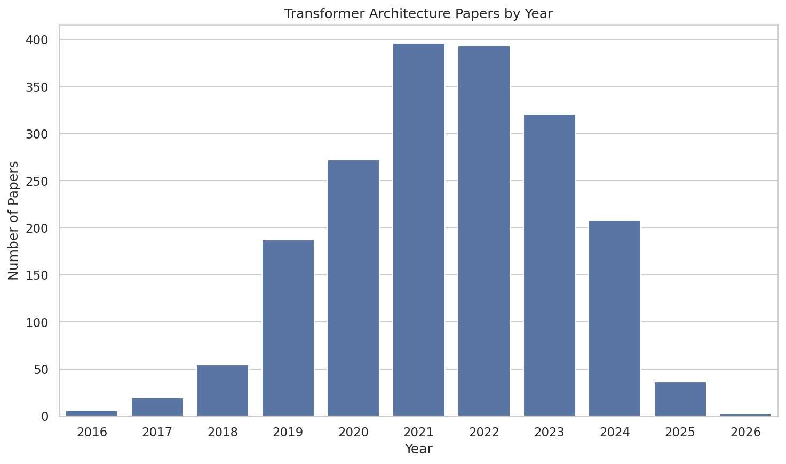
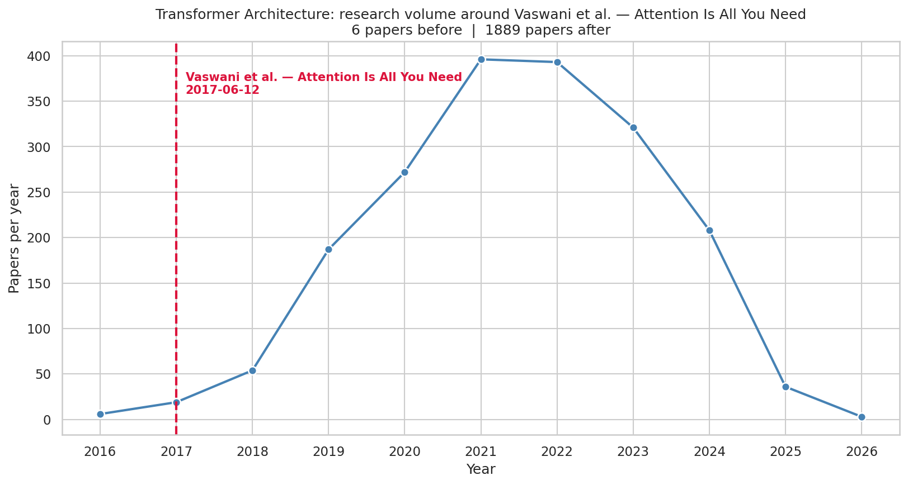
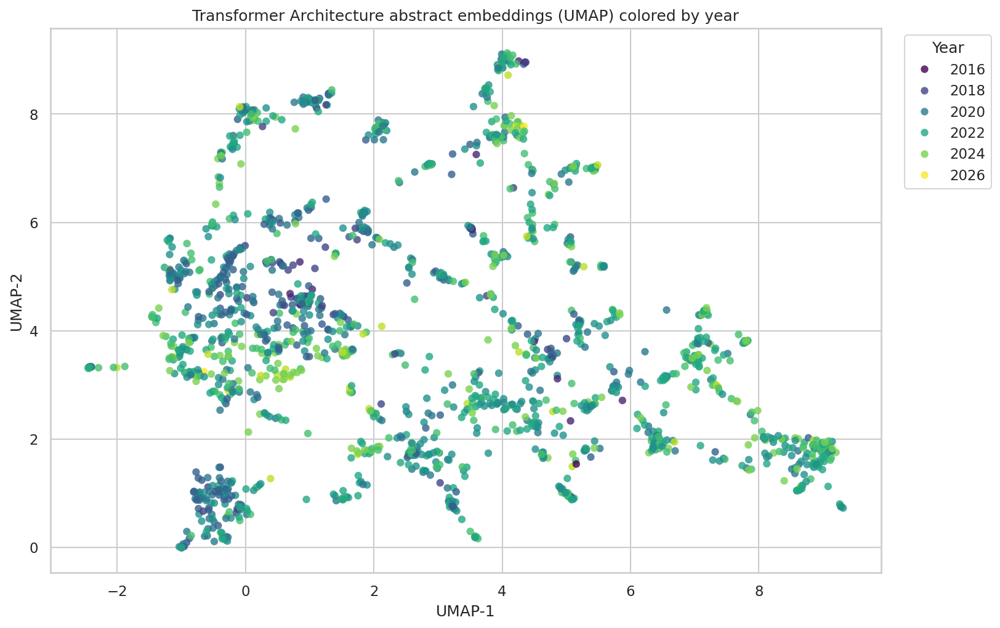

# Tutorial

[← Back to home](index.md)

This page walks through installing the `ml_research_trends` package and using
it to collect, analyze, and visualize papers for a topic.

The code blocks below were actually run on the Transformer Architecture dataset
that lives in `local_data/transformer/`, and the output shown under each block
is the real output from that run.

## 1. Install

Clone the repo and install in editable mode:

```bash
git clone https://github.com/dallinmj/ml_research_trends.git
cd ml_research_trends
pip install -e .
```

If you plan to collect new data (as opposed to just using the CSVs already in
`local_data/`), add a `.env` file at the project root:

```
API_KEY=your_semantic_scholar_key_here
```

You can get a free key from [Semantic Scholar](https://www.semanticscholar.org/product/api).

## 2. Collect papers for a topic

```python
from ml_research_trends import collect_topic_data

df = collect_topic_data(
    keywords=[
        "self-attention neural network",
        "multi-head attention",
        "transformer language model",
        "encoder decoder transformer",
    ],
    max_results_per_keyword=200,
    min_year=2016,
    max_year=2026,
    save_path="transformer_papers.csv",
)

print(df[["title", "year", "citation_count", "venue"]].head())
print("Total papers:", len(df))
```

This queries Semantic Scholar for each keyword, de-duplicates the results,
filters by year, and returns a tidy `pandas.DataFrame`. It also writes the
DataFrame to CSV if `save_path` is given.

Output:

```
                                                                                                                         title  year  citation_count              venue
0                                             Self-attention neural network for solving correlated electron problems in solids  2025              17  Physical review B
1                     Three-dimensional DenseNet self-attention neural network for automatic detection of student’s engagement  2022              81                NaN
2                                               Solving the fractional quantum Hall problem with self-attention neural network  2024              27  Physical review B
3  Crystallographic phase identifier of a convolutional self-attention neural network (CPICANN) on powder diffraction patterns  2024               8              IUCrJ
4                                          A new deep self-attention neural network for GNSS coordinate time series prediction  2023              19      GPS Solutions
Total papers: 1895
```

## 3. Summarize and analyze

```python
from ml_research_trends import summarize_topic_data, analyze_topic_trends

summary = summarize_topic_data(df)
print("Total papers:", summary["total_papers"])
print("Year range:", summary["year_min"], "-", summary["year_max"])
print("Median citations:", summary["median_citations"])

trends = analyze_topic_trends(df)
print(trends)
```

Output:

```
Total papers: 1895
Year range: 2016 - 2026
Median citations: 71.0

 year  paper_count  average_citations  median_citations
 2016            6         255.500000             229.5
 2017           19       10688.631579             117.0
 2018           54         211.592593             121.0
 2019          187         706.705882              95.0
 2020          272         364.930147              86.0
 2021          396         429.401515              85.5
 2022          393         233.030534              66.0
 2023          321         188.573209              54.0
 2024          208         158.485577              48.0
 2025           36          80.027778              34.0
 2026            3          55.666667               0.0
```

## 4. Make plots

```python
from ml_research_trends import (
    plot_topic_counts_by_year,
    plot_landmark_timeline,
    embed_and_plot_abstracts,
)

plot_topic_counts_by_year(trends, topic_name="Transformer Architecture", save_path="transformer_by_year.png")
```



```python
plot_landmark_timeline(
    df,
    landmark_date="2017-06-12",
    landmark_label="Vaswani et al. — Attention Is All You Need",
    topic_name="Transformer Architecture",
    save_path="transformer_timeline.png",
)
```



```python
embed_and_plot_abstracts(
    df,
    model_name_or_path="Qwen/Qwen3-Embedding-4B",
    reducer="umap",
    cache_path="transformer_embeddings.npy",
    topic_name="Transformer Architecture",
    save_path="transformer_umap.png",
    html_path="transformer_umap.html",
)
```

Embedding the first time will download the model (~8 GB) and cache the
vectors to `cache_path`. After that, rerunning is fast.



## 5. Run the Streamlit app

From the project root:

```bash
streamlit run app.py
```

Then open the URL. Pick a topic in
the sidebar and explore the Overview, Trends Over Time, and Topic Embeddings
pages.
